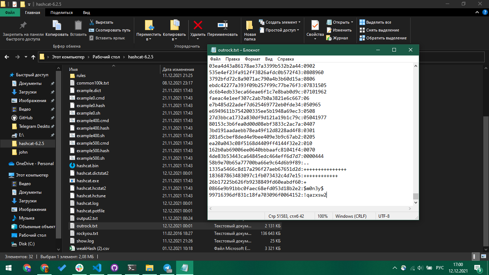
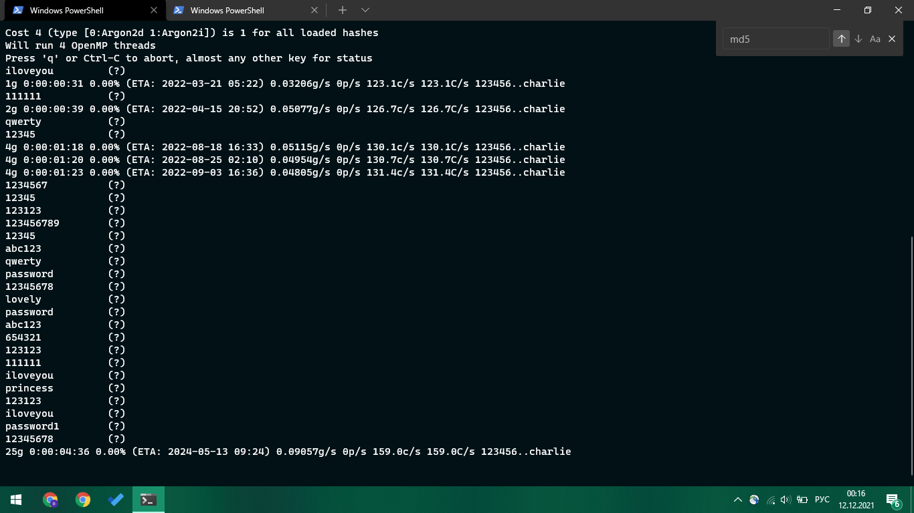

# 4. Human-like password generator

## Part 1

In this part of the lab we had to create a password generator.

The requirement was to make a list of passwords and to save it to .csv file. The list we generate includes:

- 5% chance of getting one of 25 common passwords.
- 10% chance of getting one of 100k common passwords.
- 15% chance of getting a random password of 6 to 8 characters.
- 70% chance of getting human-like generated password.(using a library here to make it simple).

In total we generate 100k passwords. For hasing we used:

- md5 for weak hash
- bcrypt with salt with complexity 5 for strong hash

Files were shared in Telegram chat.

## Part 2

In this part we had to grab the files, shared by other course members, try to crack them and analyze them.

We grabbed 2 files: weak hash md5 and strong hash argon2i with salt.

### Cracking md5

This part is pretty straightforward: concluding that the same most common passwords file was used we can use a tool called `hashcat` with that same wordlist. Using the command

`.\hashcat.exe -m 0 '.\weakHash (2).csv' .\rockyou.txt -O -d 1 -o outrock.txt`

we can provide mode 0(md5), hashes file(weakHash) and wordlist(rockyou). -d specifies device to use(GPU in our example), and -o specifies output file.

In conclusion, we managed to crack 50k passwords. For the rest other techniquies may be used, such as bruteforce with rules or rainbow tables. And also, we managed to crack 50k passwords on a mid-end GPU in about 5-10 minutes.

P.S. rockyou file was grabbed from [here](https://github.com/praetorian-inc/Hob0Rules/blob/master/wordlists/rockyou.txt.gz).

### Cracking argon2i

Here we can't use hashcat, because cracking argon is not in scope of that tool. Instead we used John the Ripper with following command:

`.\run\john.exe --format=argon2 '.\strongHash.csv' --wordlist=rockyou.txt`

As you can see we used same word list. The trouble with argon is that it can't be cracked using GPU, so cracking here was much much slower and was interrupted in about 5 minutes. The details can be found in [this stackExchange answer](https://crypto.stackexchange.com/a/63050).

In cocnlusion we can say that argon2 today is a good way to hash something and to protect hashes from being "unhashed". No comments for md5😊.
